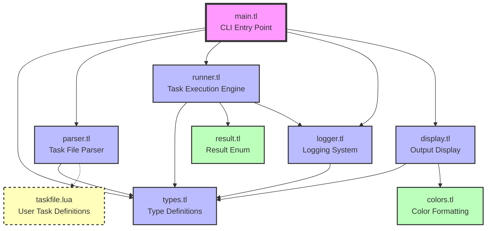

# LuaTask Module Dependencies

This flowchart shows the module dependencies and connections in the LuaTask project.

## Module Description

### Entry Point
- **main.tl**: CLI argument parsing, task loading, and execution coordination

### Core Modules
- **types.tl**: Central type definitions for all data structures
- **parser.tl**: Loads and validates taskfile.lua, converts to internal types
- **runner.tl**: Task execution engine with dependency resolution
- **display.tl**: Tree visualization and output formatting
- **logger.tl**: Leveled logging system with per-task message storage

### Utility Modules
- **colors.tl**: Catppuccin Mocha color palette for ANSI formatting
- **result.tl**: Simple enum for task execution results (SUCCESS/FAIL)

### External Files
- **taskfile.lua**: User-defined tasks (loaded dynamically by parser)

## Dependency Flow

1. **main.tl** orchestrates the entire system by importing all core modules
2. **types.tl** is the foundation - imported by almost all modules for shared data structures
3. **parser.tl** loads user task definitions and validates them against types
4. **runner.tl** executes tasks using types and result definitions, with logging support
5. **display.tl** presents results using color formatting and type definitions
6. **logger.tl** provides logging capabilities used by runner and available to user tasks

The system follows a clean layered architecture where the main entry point coordinates between specialized modules, each with clearly defined responsibilities.