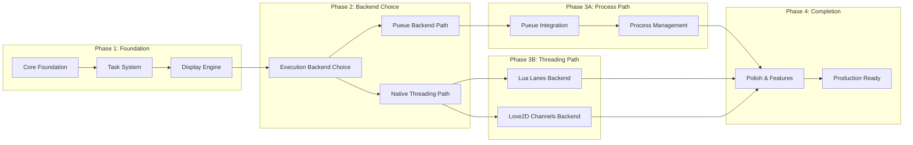

# LuaTask - Lua-based Task Runner (Refactored)

A Just-inspired task runner written in Teal that uses Lua for both the executable and task files, featuring **true tree-structured** task display, proper threading/process management, and beautiful Catppuccin Mocha theming.

## Project Overview

### Core Requirements (Updated)
- **Task runner inspired by Just** - Simple, declarative task definitions
- **Lua-based** - Both the executable and task files use Lua/Teal
- **True tree structure display** - Proper hierarchical task dependencies and execution (not fake lists)
- **Real threading/process management** - Tasks run with actual status tracking
- **Leveled logging system** - Configurable log output with buffer-based display
- **Exit handling** - Clear success/failure states using optional returns and error()/assert()
- **Written in Teal** - Typed Lua for better maintainability
- **Just-like arguments** - Tasks support positional arguments with defaults
- **Dual execution models** - Pueue backend OR native threading options
- **Task grouping** - Organize tasks by category with improved display
- **Catppuccin Mocha theming** - Beautiful colored output with bold text
- **Built-in shell support** - luash library for shell commands with silent mode
- **Default task support** - Task that runs when no specific task is given
- **Timing controls** - Show execution times with configurable precision

### Target Specifications
- **Lua Version**: 5.1 (compatible with LuaJIT)
- **Dependencies**: Minimal core + optional threading backends
- **No built-in tasks** - Pure task runner, no magic commands
- **No task overloading** - One task per name
- **No multi-scripting support** - Pure Lua functions only
- **Optional argument validation** - Validate when specified, ignore otherwise
- **No automatic task discovery** - Explicit task definitions only
- **Buffer-based display** - Store entire output in buffer for proper tree rendering

## Architecture Roadmap



## Project Structure (Updated)

```
luatask/
├── src/
│   ├── main.tl              # Entry point & CLI parsing
│   ├── parser.tl            # Task file parser with error bubbling
│   ├── display/
│   │   ├── buffer.tl        # Output buffer management for true tree display
│   │   ├── tree.tl          # True tree structure (not fake lists)
│   │   └── renderer.tl      # Catppuccin rendering with line clearing
│   ├── execution/
│   │   ├── runner.tl        # Base execution interface
│   │   ├── pueue.tl         # Pueue backend implementation
│   │   ├── lanes.tl         # Lua Lanes threading backend
│   │   └── love2d.tl        # Love2D channels backend
│   ├── libs/
│   │   └── luash.tl         # Built-in shell command library
│   ├── logger.tl            # Logging system with buffer integration
│   ├── args.tl              # Just-like argument parsing utilities
│   ├── colors.tl            # Catppuccin Mocha color palette
│   ├── result.tl            # Result handling (optional returns)
│   ├── timing.tl            # Execution timing with configurable precision
│   └── types.tl             # Core type definitions
├── examples/
│   └── taskfile.lua         # Example task file with all features
├── tests/
│   ├── test_parser.tl       # Parser tests
│   ├── test_execution.tl    # Execution backend tests
│   ├── test_display.tl      # Display and buffer tests
│   └── test_args.tl         # Argument parsing tests
├── teal-config.lua          # Teal compiler configuration
├── Makefile                 # Build automation
└── README.md                # Project documentation
```

## Core Components (Updated)

### 1. Result System (result.tl) - FIXED

**Purpose**: Optional return handling with error bubbling

```lua
-- Tasks can:
-- 1. Return nothing (success by default)
-- 2. Return values (success with data)
-- 3. Use error() or assert() to fail explicitly

local function run_task(task_fn, ...)
    local success, result = pcall(task_fn, ...)
    if not success then
        return false, result  -- error message
    end
    return true, result  -- success, optional return values
end
```

### 2. Task File Format (Updated)

**File**: `taskfile.lua` (user-defined)

**Structure**:
```lua
local tasks = {}

-- Default task (runs when no task specified)
tasks.default = "build"  -- or function

-- Simplified structure with index support
tasks[1] = {  -- Alternative to tasks.clean =
    name = "clean",
    description = "Clean build artifacts",
    group = "build",
    run = function()
        luash.rm("-rf", "build/")
        -- No return needed - success by default
    end
}

tasks.build = {
    description = "Build project [target] [mode='release']",
    group = "build",
    dependencies = {"clean"},
    run = function(target, mode)
        target = target or "x86_64"
        mode = mode or "release"

        luash.silent(true)  -- Silent mode
        local result = luash.run("make", target, mode)
        if not result.success then
            error("Build failed: " .. result.error)
        end

        return result.artifacts, result.build_time  -- Return values
    end
}

tasks.deploy = {
    description = "Deploy to environment [env='staging']",
    group = "deploy",
    dependencies = {{"build", "x86_64", "release"}},  -- With args
    run = function(env)
        env = env or "staging"
        assert(env == "staging" or env == "production", "Invalid environment")

        -- Task logic here
        return deployment_id
    end
}

return tasks
```

### 3. Display System (display/) - MAJOR REWRITE

**True Tree Structure**:
- Not fake lists - actual hierarchical dependency trees
- Buffer-based rendering for proper line management
- Real-time status updates during execution
- Proper line clearing for corner drawing

**Buffer Management** (`buffer.tl`):
```lua
local DisplayBuffer = {
    lines = {},     -- Array of line content
    tree_pos = {},  -- Tree position data for each line
    dirty = {},     -- Lines that need redrawing
}

function DisplayBuffer:update_line(line_num, content, tree_data)
    self.lines[line_num] = content
    self.tree_pos[line_num] = tree_data
    self.dirty[line_num] = true
end

function DisplayBuffer:render()
    -- Clear dirty lines and redraw
    for line_num in pairs(self.dirty) do
        -- Move cursor, clear line, draw content
    end
    self.dirty = {}
end
```

### 4. List Output Format - RESTRUCTURED

**New Format**:
```
Available tasks:

build:
  clean: - Clean build artifacts
  build [target] [mode='release']: clean - Build project for target

deploy:
  deploy [env='staging']: build(x86_64, release) - Deploy to environment

testing:
  test [pattern...]: build - Run tests with optional pattern filter

Other tasks:
  check_deps: - Check system dependencies
```

### 5. Execution Backends (execution/)

**Base Interface** (`runner.tl`):
```lua
local record ExecutionBackend
    name: string
    start_task: function(TaskExecution): boolean
    check_status: function(TaskExecution): string  -- "running", "success", "fail"
    get_output: function(TaskExecution): string
    cleanup: function()
end
```

#### Path A: Pueue Backend (`pueue.tl`)
- Uses pueue daemon for process management
- No threading needed, just coroutines for polling
- Better isolation and process control
- Can survive luatask crashes

```lua
local PueueBackend = {
    name = "pueue"
}

function PueueBackend:start_task(task_exec)
    local cmd = string.format("luatask-runner %s %s",
        task_exec.name, table.concat(task_exec.args, " "))
    local pueue_id = luash.capture("pueue add " .. cmd)
    task_exec.backend_id = pueue_id
    return true
end

function PueueBackend:check_status(task_exec)
    local status = luash.capture("pueue status " .. task_exec.backend_id)
    -- Parse pueue output and return status
end
```

#### Path B1: Lua Lanes Backend (`lanes.tl`)
- True threading with shared state
- Good for CPU-bound tasks
- Proper parallel execution

```lua
local LanesBackend = {
    name = "lanes"
}

function LanesBackend:start_task(task_exec)
    local lanes = require "lanes"
    local linda = lanes.linda()

    local thread = lanes.gen("*", function()
        -- Run task in separate thread
        -- Communicate via linda
    end)()

    task_exec.thread = thread
    task_exec.linda = linda
    return true
end
```

#### Path B2: Love2D Channels Backend (`love2d.tl`)
- Uses Love2D's channel system
- Great for async I/O
- Modern Lua threading approach

```lua
local Love2DBackend = {
    name = "love2d"
}

function Love2DBackend:start_task(task_exec)
    local love = require "love"
    local channel = love.thread.newChannel()
    local thread = love.thread.newThread("task_runner.lua")

    thread:start(channel, task_exec.name, task_exec.args)
    task_exec.thread = thread
    task_exec.channel = channel
    return true
end
```

### 6. Built-in Shell Library (libs/luash.tl)

**Features**:
- Silent mode for commands
- Proper error handling
- Cross-platform compatibility

```lua
local luash = {}
local silent_mode = false

function luash.silent(enabled)
    silent_mode = enabled
end

function luash.run(cmd, ...)
    local full_cmd = cmd .. " " .. table.concat({...}, " ")
    if not silent_mode then
        log.info("Running: " .. full_cmd)
    end

    local handle = io.popen(full_cmd .. " 2>&1")
    local output = handle:read("*a")
    local success = handle:close()

    return {
        success = success,
        output = output,
        error = success and nil or output
    }
end

function luash.capture(cmd)
    local result = luash.run(cmd)
    if not result.success then
        error("Command failed: " .. cmd .. "\n" .. result.error)
    end
    return result.output:gsub("\n$", "")  -- Trim trailing newline
end

-- Convenience functions
function luash.rm(...)
    return luash.run("rm", ...)
end

function luash.mkdir(...)
    return luash.run("mkdir", ...)
end
```

### 7. Timing System (timing.tl)

**Features**:
- Default: Show times > 1s
- `--timings`: Show all times in ms
- Configurable precision

```lua
local timing = {}

function timing.should_show(duration, show_all)
    if show_all then return true end
    return duration >= 1.0  -- 1 second threshold
end

function timing.format(duration, show_ms)
    if show_ms or duration < 1.0 then
        return string.format("%.0fms", duration * 1000)
    else
        return string.format("%.1fs", duration)
    end
end
```

### 8. CLI Interface (Updated)

**Enhanced Options**:
```bash
luatask                          # Run default task (if defined)
luatask --list                   # Show grouped task list
luatask --timings build          # Show all times in ms
luatask --backend pueue build    # Use specific backend
luatask --backend lanes build    # Use Lua Lanes backend
luatask --backend love2d build   # Use Love2D channels backend
luatask --silent build           # Enable luash silent mode globally
luatask --tree build             # Show execution tree (real tree, not fake)
```

## Implementation Phases (Updated Roadmap)

### Phase 1: Foundation Fixes ✅ → 🔄
**Status**: Core structure exists, needs fixes

**Tasks**:
- [x] Basic task structure
- [ ] Fix fake tree structure → real tree
- [ ] Implement error bubbling for missing tasks
- [ ] Add buffer-based display system
- [ ] Fix last result not showing
- [x] Implement optional return handling

### Phase 2: Enhanced Task System ⏳
**Status**: In progress

**Tasks**:
- [ ] Add default task support
- [ ] Implement luash built-in library
- [ ] Add timing system with --timings flag
- [ ] Support index-based task definitions
- [ ] Restructure list output format

### Phase 3A: Pueue Backend Path 🆕
**Status**: New implementation

**Tasks**:
- [ ] Implement pueue backend interface
- [ ] Add process management via pueue
- [ ] Integrate with display buffer system
- [ ] Add real-time status polling
- [ ] Test isolation and crash recovery

### Phase 3B: Native Threading Paths 🆕
**Status**: New implementation

**Tasks**:
- [ ] Implement Lua Lanes backend
- [ ] Implement Love2D channels backend
- [ ] Add thread-safe logging
- [ ] Integrate with display buffer system
- [ ] Performance testing and optimization

### Phase 4: Polish & Production 🔄
**Status**: Ongoing improvements

**Tasks**:
- [ ] Comprehensive testing for all backends
- [ ] Performance optimization
- [ ] Documentation updates
- [ ] Edge case handling
- [ ] User experience improvements

## Backend Comparison

| Feature | Pueue | Lua Lanes | Love2D |
|---------|-------|-----------|---------|
| **Isolation** | ✅ Process | ❌ Threads | ❌ Threads |
| **Crash Recovery** | ✅ Survives | ❌ Dies with main | ❌ Dies with main |
| **Setup** | 📦 External | 📦 C Extension | 📦 Love2D Required |
| **Performance** | 🐌 Process overhead | ⚡ Native threads | ⚡ Fast channels |
| **Debugging** | ✅ External logs | 🔧 Complex | 🔧 Moderate |
| **Cross-platform** | ✅ Good | ⚠️ Build complexity | ✅ Excellent |

## Example Outputs (Updated)

### True Tree Execution
```
Running: deploy_production

deploy_production
├─ build(x86_64, release) ⟳
│  ├─ clean ✓ (0.1s)
│  └─ build ⟳ (1.2s so far...)
│     └─ INFO: Compiling main.c...
├─ test ○ (waiting for build)
└─ deploy_staging ○ (waiting for test)

Current: Building x86_64 release (73% complete)
```

### Completed Execution
```
deploy_production ✓ (4.9s)
├─ build(x86_64, release) ✓ (2.3s)
│  ├─ clean ✓ (0.1s)
│  └─ build ✓ (2.2s)
│     ├─ INFO: Building x86_64 in release mode...
│     └─ Returned: 42 artifacts, build_time=1623456789
├─ test ✓ (1.8s)
│  ├─ INFO: Running tests...
│  └─ Returned: 42 tests passed
├─ deploy_staging ✓ (0.5s)
│  └─ Returned: deployment_id=deploy-1623456790
└─ deploy_production ✓ (0.3s)

Total: 4.9s, Backend: pueue
```

This refactored plan addresses all the issues in fix.md while providing clear paths for both the pueue backend approach and native threading options.
